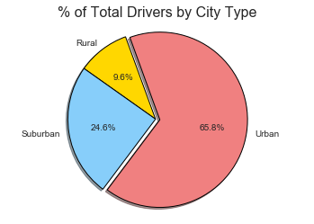

## Pyber

Offer data-backed guidance on new opportunities for market differentiation.

Given access to the company's complete recordset of rides, the objective is to build a Bubble Plot that showcases the relationship between four key variables:
- Average Fare ($) Per City
- Total Number of Rides Per City
- Total Number of Drivers Per City
- City Type (Urban, Suburban, Rural)

In addition, produce the following three pie charts:
- % of Total Fares by City Type

- % of Total Rides by City Type

- % of Total Drivers by City Type

**Observable Trends**
- Observable Trend 1 - Rural cities have the highest average fare and account for the least number of rides and drivers.
- Observable Trend 2 - Urban cities have the lowest average fare and account for the highest number of rides and drivers.
- Observable Trend 3 - Consistency in relative percentages based on city type seem to indicate that the different variables are interrrelated and potentially interdependent.

**Languages and Tools:**
- Pandas
- Jupyter Notebook
- Matplotlib
- Seaborn

